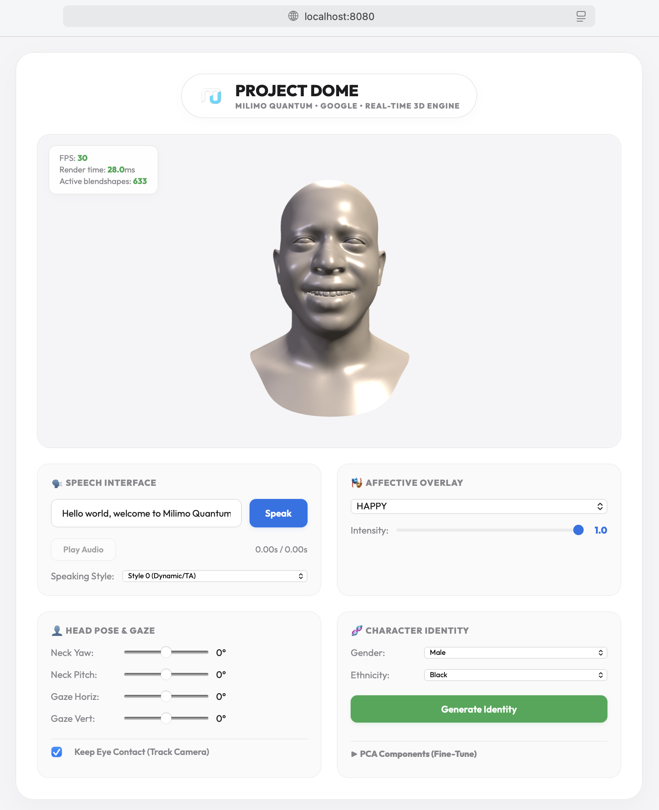

<p align="center">
  
</p>

<p align="center">
  
</p>

# Project Dome

Project Dome is a from-scratch conversational 3D avatar engine built on Google's parametric **Generative Anthropometric Model (GNM) Head** model (Apache 2.0). 

It aligns state-of-the-art 3D morphable model (3DMM) geometry with acoustic speech processing pipelines to drive real-time viseme animations and affective overlays directly in web browsers.

---

## Authors & Attributes

*   **Author:** Mainza Kangombe
*   **LinkedIn:** [Mainza Kangombe](https://www.linkedin.com/in/mainza-kangombe-6214295)

---

## Key Features

1.  **High-Fidelity 3DMM Geometry:** Utilizes GNM Head v3.0 (17,821 vertices, 253 identity shape components, 383 expression PCA parameters).
2.  **Acoustic Phonetic forced Alignment:** Pipeline converts text input to speech audio using Piper TTS, resamples to 16kHz, aligns with `Wav2TextGrid` (Wav2Vec2), and maps outputs to a 13-viseme mouth shape timeline.
3.  **Real-Time Browser Renderer:** Three.js-based client featuring a customized CPU deforming loop for sparse mesh interpolation, bypassing mobile/browser float16 texture limitations. Redesigned with a premium Apple light-mode aesthetic and Google-colored indicators.
4.  **CVAE Affective Blending:** Connects to Keras-based Expression Samplers on the server to dynamically blend semantic emotions (such as happy, surprise, corners down) into speech visemes in real time.
5.  **Multi-Subject Speaking Styles (VOCASET Integration):** Incorporates training layouts and alignments from the VOCASET 4D face dataset.

---

## Getting Started

### 1. Prerequisites
Ensure you have **Python 3.12** or **Python 3.13** installed, along with `uv` for package management:
```bash
brew install uv
```

### 2. Installation
Run the setup script to initialize virtual environments, clone submodules (`google/GNM` and `TimoBolkart/voca`), and install all dependencies:
```bash
chmod +x setup.sh
./setup.sh
```

### 3. Run the Development Server
Launch the HTTP server and pipeline endpoints:
```bash
./venv/bin/python src/server.py
```
By default, the application is available at:
👉 **[http://localhost:8080/](http://localhost:8080/)**

---

## Project Structure

```
├── setup.sh                   # Environment setup script
├── README.md                  # Project documentation and attributes
├── src/
│   ├── server.py              # Local HTTP API & static assets server
│   ├── voice/                 # Piper Text-to-Speech wrappers
│   ├── alignment/             # Wav2TextGrid forced aligner & viseme mapper
│   ├── animation/             # Coefficient blender & viseme interpolation
│   └── training/              # VOCASET reprojection and deep learning model
├── tools/
│   ├── export_basis.py        # Compiles GNM basis buffers to binary
│   └── tune_visemes.py        # Interactive CLI viseme editor
├── web/                       # Three.js browser client codebase
│   ├── index.html             # Client entrypoint
│   ├── renderer.js            # Three.js loop and deformation math
│   └── style.css              # Premium stylesheet
└── vendor/
    ├── GNM/                   # Google GNM Head submodule
    └── voca/                  # TimoBolkart VOCA submodule
```
