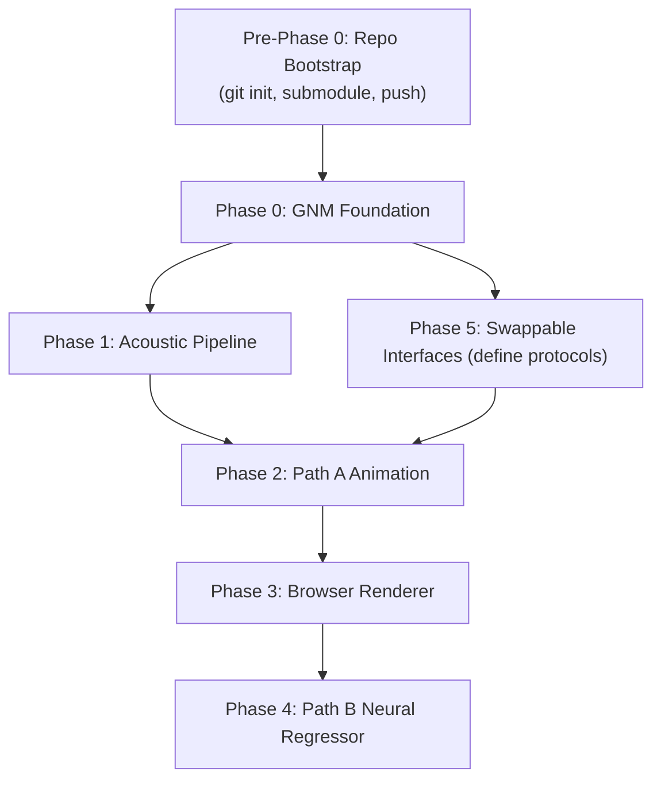

# Project Dome — Implementation Plan

Bootstrap a conversational 3D avatar engine on Google's GNM Head model (Apache 2.0). $0 budget — every tool fully local, open-source, no usage caps.

## User Review Required

> [!IMPORTANT]
> **Renderer lock-in:** This plan builds a WebGPU-first prototype in Phase 3. The GNM skinning math lives in a renderer-agnostic Python/JS module, so we can add a native RealityKit path later without refactoring the pipeline. Please confirm browser-first is still the priority.

> [!TIP]
> **VOCASET already present:** The full VOCASET dataset (~14.87 GB vertex data, DeepSpeech features, raw audio, FLAME expression basis, templates) is already downloaded at `voca/trainingdata/`. The pre-trained VOCA model checkpoint (`gstep_52280`) is at `voca/model/`. No download step needed — we can proceed directly to re-projection.

> [!WARNING]
> **ExpressionSampler dependency:** The built-in CVAE uses `expression_decoder_model.h5` which requires TensorFlow/Keras. For the emotion blending in Phase 2, we can either: (a) keep a minimal TF dependency just for this model, or (b) convert the `.h5` to ONNX and use `onnxruntime`. I recommend option (b) to avoid pulling in TensorFlow (~2 GB). Please confirm.

## Open Questions

1. **Viseme set size:** The wiki documents ~12–15 categories. The dev-docs reference Microsoft SAPI (15), MPEG-4 (14), and Disney (12). I propose starting with **13 visemes** (MPEG-4 base + IDLE). Want a different set?

2. **Target frame rate:** The roadmap says 60 fps at 1080p. For the initial Path A prototype, is 30 fps acceptable while we iterate on the coefficient table, or do you want 60 fps from day one?

3. **LLM default:** The wiki shows OMLX at `http://127.0.0.1:9000/v1`. Should I assume OMLX is already running on your machine, or should I set up Ollama as the default MindProvider?

---

## Proposed Changes

### Pre-Phase 0 — Repository Bootstrap

Initialize git, add GNM as a submodule, push to GitHub.

---

> [!IMPORTANT]
> **The remote `mainza-ai/projectdome` returned 404.** Either it's private (in which case you'll need to be authenticated when we push), or it hasn't been created yet. If it doesn't exist, create it on GitHub first (empty repo, no README/license/gitignore — we'll push our existing files). Let me know which case applies.

#### Repo initialization steps

```bash
# 1. Initialize git in the existing project directory
cd /Users/mck/Desktop/projectdome
git init

# 2. Add the remote
git remote add origin https://github.com/mainza-ai/projectdome.git

# 3. Add GNM as a git submodule (not a plain clone)
git submodule add https://github.com/google/GNM.git vendor/GNM

# 4. Create .gitignore, stage everything, initial commit
git add .
git commit -m "Initial commit: wiki, dev-docs, voca data, GNM submodule"

# 5. Push
git push -u origin main
```

#### Why a **git submodule** for GNM (not a plain clone)

| Approach | Pros | Cons |
|----------|------|------|
| `git submodule` ✅ | Pinned to a commit; `git submodule update --remote` pulls upstream fixes; no nested `.git` conflict; clean diff history | Requires `git submodule init` after fresh clone |
| Plain `git clone` into `vendor/` | Simple | Creates nested `.git` → git ignores it or conflicts; no upstream tracking; confusing history |
| `pip install` only | No source to browse/modify | Can't inspect `project_on_pca.py` source; can't reference model data paths easily |
| `git subtree` | Merges history into main repo | Pollutes commit history; harder to update |

The submodule approach means:
- `vendor/GNM/` contains the full GNM repo, pinned to a specific commit
- Our `setup.sh` does `pip install -e vendor/GNM/gnm/shape[numpy]` (editable install from submodule)
- Anyone cloning our repo runs `git submodule update --init --recursive`
- GNM updates are pulled explicitly with `git submodule update --remote`

#### Why we do **NOT** need to clone `TimoBolkart/voca`

| Concern | Resolution |
|---------|------------|
| VOCA model code | Written for Python 3.6 + TensorFlow 1.14 — won't run on modern Python. We don't use their inference code at all. |
| VOCA training data format | Already understood: `data_verts.npy` is `(N_frames, 5023, 3)` FLAME-registered vertices; `templates.pkl` is per-subject templates; `subj_seq_to_idx.pkl` maps sequences. |
| Pre-trained checkpoint | Already present at `voca/model/gstep_52280.*` — but we won't use it. Our pipeline re-projects raw vertex data to GNM's basis via `project_on_pca.py`, bypassing VOCA's model entirely. |
| FLAME model | The FLAME expression basis is already in `voca/trainingdata/init_expression_basis.npy`. No need for the separate FLAME repo. |
| DeepSpeech features | Pre-extracted at `voca/trainingdata/processed_audio_deepspeech.pkl`. For Path B we'll use wav2vec2 instead, extracting features from `raw_audio_fixed.pkl`. |

**Bottom line:** The only external repo we need is **google/GNM** (as a submodule). All VOCASET data is already local. The VOCA repo is legacy TF 1.x code that we won't call.

#### [NEW] `.gitignore`
```gitignore
# Python
venv/
__pycache__/
*.pyc
*.egg-info/
.eggs/
dist/
build/

# Large data (tracked via Git LFS or excluded)
voca/trainingdata/data_verts.npy
voca/trainingdata/processed_audio_deepspeech.pkl
voca/trainingdata/raw_audio_fixed.pkl
voca/model/gstep_52280.model.data-*

# Generated output
output/
data/web/

# OS
.DS_Store
Thumbs.db

# IDE
.vscode/
.idea/
*.swp
```

> [!NOTE]
> The large VOCASET files (`data_verts.npy` at 14.87 GB, `processed_audio_deepspeech.pkl` at 1.43 GB, `raw_audio_fixed.pkl` at 308 MB) and the VOCA checkpoint are excluded from git. They stay local. The smaller metadata files (`templates.pkl`, `subj_seq_to_idx.pkl`, `init_expression_basis.npy`, `readme.pdf`) are small enough to commit (~18 MB total). If you want ALL voca data excluded, I can add `voca/` to .gitignore instead.

---

### Phase 0 — GNM Foundation

Set up the Python environment from the GNM submodule, load the model, and produce a sanity-check mesh.

---

#### [NEW] `setup.sh`
Top-level bootstrap script:
- Create Python 3.13 venv at `./venv`
- `git submodule update --init --recursive` (ensures GNM is cloned)
- `pip install -e vendor/GNM/gnm/shape[numpy]` (editable install from submodule)
- Install dev dependencies: `trimesh`, `numpy`, `matplotlib`
- Verify: `python -c "from gnm.shape.gnm_numpy import GNMNumpy; print('GNM OK')"`

#### [NEW] `src/gnm_sanity_check.py`
Standalone script that:
1. Loads `v3_0/gnm_head.npz` via `gnm.shape.gnm_numpy.GNMNumpy`
2. Generates the neutral mesh (zero identity + zero expression coefficients)
3. Applies a test expression: uses `ExpressionSampler` with label `HAPPY` at intensity 1.0
4. Exports both neutral and deformed meshes to `output/neutral.obj` and `output/happy.obj`
5. Prints vertex count, face count, and max vertex displacement as a sanity check
6. Optionally renders a side-by-side comparison using `trimesh.Scene` → PNG

#### [NEW] `src/__init__.py`
Package init for the `src` module.

#### [NEW] `output/` (directory)
Output directory for generated meshes and renders.

---

### Phase 1 — Acoustic Pipeline (TTS + Forced Alignment)

Install Piper TTS and MFA, build the text → audio → phoneme timestamps → viseme timeline pipeline.

---

#### [NEW] `src/voice/__init__.py`
Package init.

#### [NEW] `src/voice/provider.py`
Abstract `VoiceProvider` protocol:
```python
class VoiceProvider(Protocol):
    def synthesize(self, text: str) -> VoiceResult: ...

@dataclass
class VoiceResult:
    audio: np.ndarray        # PCM float32
    sample_rate: int
    phoneme_events: list[PhonemeEvent]

@dataclass
class PhonemeEvent:
    phoneme: str             # ARPABET symbol
    start_time: float        # seconds
    end_time: float          # seconds
```

#### [NEW] `src/voice/piper_provider.py`
Concrete `VoiceProvider` using Piper TTS:
- `pip install piper-tts`
- Synthesizes text → WAV using `en_US-lessac-medium` voice
- Returns `VoiceResult` with raw phoneme durations from Piper

#### [NEW] `src/alignment/__init__.py`
Package init.

#### [NEW] `src/alignment/mfa_aligner.py`
Montreal Forced Aligner wrapper:
- Installs MFA via conda-forge or pip (MIT license)
- Downloads pretrained English acoustic model + pronunciation dictionary
- Takes (audio_path, transcript) → runs MFA → parses TextGrid output
- Returns `list[PhonemeEvent]` with precise timestamps (±20ms accuracy)

#### [NEW] `src/alignment/viseme_mapper.py`
Phoneme-to-viseme reduction:
- Maps ~40 ARPABET phonemes to 13 viseme categories:

| Viseme | Phonemes | Description |
|--------|----------|-------------|
| `IDLE` | (silence) | Neutral rest |
| `PP` | P, B, M | Bilabial closure |
| `FF` | F, V | Labiodental |
| `TH` | TH, DH | Dental fricative |
| `DD` | T, D, N, L | Alveolar |
| `CH` | SH, ZH, CH, JH | Postalveolar |
| `kk` | K, G, NG, HH | Velar/glottal |
| `SS` | S, Z | Alveolar sibilant |
| `RR` | R, ER | Retroflex |
| `aa` | AA, AE, AH | Open vowels |
| `EE` | EH, IH, IY, AY, EY | Front vowels |
| `OO` | UW, UH, OW, OY, AW | Rounded vowels |
| `schwa` | AX, AH0 | Neutral vowel |

- Takes `list[PhonemeEvent]` → `list[VisemeEvent]` (with merged consecutive same-visemes)

#### [NEW] `src/alignment/pipeline.py`
End-to-end orchestrator:
```python
def text_to_viseme_timeline(text: str, voice: VoiceProvider) -> tuple[np.ndarray, list[VisemeEvent]]:
    """text → Piper audio → MFA alignment → viseme timeline"""
    result = voice.synthesize(text)
    phonemes = mfa_align(result.audio, text)
    visemes = map_to_visemes(phonemes)
    return result.audio, visemes
```

---

### Phase 2 — Path A: Deterministic Viseme Animation + Emotion Blending

Hand-author viseme coefficients, build the runtime interpolation loop, and wire the ExpressionSampler for emotion overlay.

---

#### [NEW] `src/animation/__init__.py`
Package init.

#### [NEW] `src/animation/viseme_table.py`
Viseme coefficient table:
- `dict[str, np.ndarray]` mapping each of 13 viseme names → 182-dim coefficient vector
- Targets `lower_face_region_000`–`149` (150 dims) + `tongue_mean` + `tongue_000`–`030` (32 dims)
- Initial values: hand-authored placeholders based on visual tuning in GNM's demo notebook
- Includes a `save/load` mechanism (JSON or `.npz`) for iterative tuning

#### [NEW] `src/animation/interpolator.py`
Runtime viseme interpolation:
```python
class VisemeInterpolator:
    def __init__(self, viseme_table: dict[str, np.ndarray], ramp_ms: float = 40.0):
        ...
    
    def get_coefficients(self, time_s: float, timeline: list[VisemeEvent]) -> np.ndarray:
        """Returns 182-dim coefficient vector at given time via linear interpolation."""
        ...
```
- Finds the two surrounding viseme keyframes for the given time
- Computes linear interpolation factor with configurable ramp duration
- Returns interpolated 182-dim vector

#### [NEW] `src/animation/emotion_blender.py`
Emotion blending via ExpressionSampler:
- Loads `expression_decoder_model.h5` (convert to ONNX if approved)
- Maps emotion label + intensity → full 383-dim expression coefficient vector
- Additive blend strategy:
  - Speech coefficients → lower_face_region + tongue channels (indices 200–382)
  - Emotion coefficients → left_eye_region + right_eye_region + upper lower_face (indices 0–199)
  - Overlap zone (lower_face 0–149): emotion scaled by 0.3 weight
- Returns final merged 383-dim expression vector

#### [NEW] `src/animation/gnm_driver.py`
GNM skinning driver:
```python
class GNMDriver:
    def __init__(self, model_path: str):
        self.gnm = GNMNumpy.from_version('v3_0')
    
    def evaluate(self, identity_coeffs: np.ndarray, expression_coeffs: np.ndarray) -> np.ndarray:
        """Run GNM forward pass → (17821, 3) vertex positions."""
        ...
    
    def evaluate_to_obj(self, vertices: np.ndarray, output_path: str):
        """Export vertex buffer to .obj file."""
        ...
```

#### [NEW] `src/animation/runtime_loop.py`
Main animation loop (offline, for testing):
```python
def animate_utterance(text: str, emotion: str = None, emotion_intensity: float = 0.5):
    """Full pipeline: text → audio → visemes → GNM frames → .obj sequence or video."""
    audio, visemes = text_to_viseme_timeline(text, PiperProvider())
    
    fps = 30
    for frame_idx in range(int(len(audio) / sample_rate * fps)):
        time_s = frame_idx / fps
        speech_coeffs = interpolator.get_coefficients(time_s, visemes)
        emotion_coeffs = blender.get_emotion_coeffs(emotion, emotion_intensity)
        merged = blender.merge(speech_coeffs, emotion_coeffs)
        vertices = driver.evaluate(identity_coeffs, merged)
        # Write frame or accumulate for video
```

#### [NEW] `tools/tune_visemes.py`
Interactive viseme tuning tool:
- Loads GNM model
- For each viseme, lets user adjust the 182-dim coefficient vector
- Shows before/after mesh renders
- Saves updated table to `data/viseme_table.npz`

#### [NEW] `data/viseme_table.npz`
Serialized viseme coefficient table (13 visemes × 182 dims).

---

### Phase 3 — Browser Renderer (WebGPU/WebGL2)

Pack GNM basis data and build a minimal in-browser renderer to prove real-time performance.

---

#### [NEW] `tools/export_basis.py`
Exports GNM model data to binary format for browser consumption:
- Mean vertex positions → `data/web/mean_positions.bin` (float32, 17821 × 3)
- Expression basis → `data/web/expression_basis.bin` (float16, 383 × 17821 × 3, ≈41 MB)
- Identity basis → `data/web/identity_basis.bin` (float16, 253 × 17821 × 3, ≈27 MB)
- Face indices → `data/web/face_indices.bin` (uint32)
- Metadata JSON with dimensions, data types, byte offsets

#### [NEW] `web/index.html`
Main page:
- Loads WebGPU renderer
- Controls: play/pause, emotion selector, identity sliders
- Audio playback via Web Audio API
- Falls back to WebGL2 if WebGPU unavailable

#### [NEW] `web/renderer.js`
Core renderer module:
- **WebGPU path:** Compute shader evaluates `mean + identity_basis @ id + expression_basis @ expr`
- **WebGL2 fallback:** Vertex shader with uniform-based coefficient upload
- Handles buffer creation, pipeline setup, render loop
- Performance monitoring (frame time, FPS counter)

#### [NEW] `web/shaders/deform.wgsl`
WebGPU compute shader:
```wgsl
@compute @workgroup_size(256)
fn deform_vertices(@builtin(global_invocation_id) gid: vec3<u32>) {
    let vid = gid.x;
    if (vid >= uniforms.num_vertices) { return; }
    
    var pos = mean_positions[vid];
    for (var i = 0u; i < uniforms.num_expr_params; i++) {
        pos += expr_basis[i * uniforms.num_vertices + vid] * expr_coeffs[i];
    }
    for (var i = 0u; i < uniforms.num_id_params; i++) {
        pos += id_basis[i * uniforms.num_vertices + vid] * id_coeffs[i];
    }
    output_positions[vid] = pos;
}
```

#### [NEW] `web/shaders/render.wgsl`
Vertex + fragment shader for PBR-like rendering:
- Reads deformed positions from storage buffer
- Computes normals from triangle adjacency
- Simple directional lighting + ambient

#### [NEW] `web/shaders/deform_fallback.vert` / `deform_fallback.frag`
WebGL2 fallback shaders (GLSL ES 3.0).

#### [NEW] `web/audio_sync.js`
Audio synchronization module:
- Uses `AudioContext.currentTime` for frame-accurate sync
- Loads pre-computed viseme timeline JSON
- Queries current viseme coefficients at each animation frame
- Sends coefficient updates to the renderer

#### [NEW] `web/animation_controller.js`
Client-side animation controller:
- Receives viseme timeline + emotion data from Python backend (or pre-computed JSON)
- Runs interpolation logic in JS (port of `src/animation/interpolator.py`)
- Merges speech + emotion coefficients
- Feeds merged coefficients to renderer each frame

#### [NEW] `web/style.css`
Minimal styling for the renderer page.

---

### Phase 4 — Path B: Neural Regressor (after Path A + renderer work end-to-end)

Re-project VOCASET to GNM basis and train a sequence model.

---

#### [NEW] `src/training/__init__.py`
Package init.

#### [NEW] `src/training/reproject_vocaset.py`
Re-projection pipeline:
- Loads VOCASET FLAME-topology mesh sequences from `voca/trainingdata/data_verts.npy` (14.87 GB, already downloaded)
- Uses `voca/trainingdata/init_expression_basis.npy` (FLAME expression basis) as reference
- Uses `voca/trainingdata/templates.pkl` for per-subject template meshes
- For each frame, calls `project_on_linear_vertex_basis()` with GNM's expression basis
- Extracts the 182-dim lower_face + tongue coefficients from the full 383-dim result
- Pairs with audio from `voca/trainingdata/raw_audio_fixed.pkl` (or pre-extracted DeepSpeech features from `processed_audio_deepspeech.pkl`)
- Saves `(audio_features, gnm_coefficient_sequence)` pairs to `voca/model/reprojected/`
- Logs reconstruction error per frame for quality assurance
- Uses `voca/trainingdata/subj_seq_to_idx.pkl` for sequence/speaker metadata

#### [NEW] `src/training/dataset.py`
PyTorch `Dataset` class:
- Loads re-projected `(audio, coefficient_sequence)` pairs
- Extracts mel-spectrogram or wav2vec2 features from audio
- Handles batching, padding, and train/val/test splits (80/10/10)
- Speaker ID encoding (12 speakers in VOCASET)

#### [NEW] `src/training/model.py`
Sequence model (FaceFormer-inspired):
```python
class SpeechToFaceModel(nn.Module):
    def __init__(self, audio_dim=768, output_dim=182, num_layers=4, num_heads=8):
        self.audio_encoder = ...  # wav2vec2 feature extractor (frozen)
        self.transformer = nn.TransformerEncoder(...)  # causal attention
        self.output_head = nn.Linear(hidden_dim, output_dim)
        self.speaker_embedding = nn.Embedding(num_speakers, hidden_dim)
    
    def forward(self, audio_features, speaker_id):
        ...  # → (batch, seq_len, 182)
```

#### [NEW] `src/training/train.py`
Training loop:
- Loss: L1 on coefficients + velocity loss (L1 on frame-to-frame differences)
- Optimizer: AdamW, lr=1e-4, cosine decay
- Batch size: 8 sequences
- ~50 epochs (early stopping on validation loss)
- Checkpoints to `voca/model/checkpoints/`
- Logging: loss curves, sample predictions vs ground truth

#### [NEW] `src/training/evaluate.py`
Evaluation script:
- Computes LVE (Lip Vertex Error) on test set
- Generates side-by-side animations: Path A vs Path B vs ground truth
- Reports per-viseme accuracy breakdown

---

### Phase 5 — Swappable Interfaces ("Mind" + "Voice")

Ensure clean provider abstractions so LLM and TTS are never hardcoded.

---

#### [NEW] `src/mind/__init__.py`
Package init.

#### [NEW] `src/mind/provider.py`
Abstract `MindProvider` protocol:
```python
class MindProvider(Protocol):
    def generate(self, user_input: str, context: ConversationContext) -> MindResponse: ...

@dataclass
class MindResponse:
    text: str
    emotion: str | None       # one of 20 ExpressionSampler labels
    emotion_intensity: float   # 0.0–1.0
```

#### [NEW] `src/mind/local_provider.py`
Default `MindProvider` using local LLM:
- Connects to OMLX at `http://127.0.0.1:9000/v1` (OpenAI-compatible)
- System prompt instructs the LLM to tag responses with emotion labels
- Parses emotion tags from response metadata
- Falls back to `None` emotion if tag parsing fails

#### [NEW] `src/mind/conversation.py`
Conversation context manager:
- Maintains chat history
- Formats system prompt with emotion-tagging instructions
- Manages context window limits

---

## Project Structure (Final)

```
projectdome/
├── .git/
├── .gitignore                        # Pre-Phase 0
├── .gitmodules                       # Pre-Phase 0 (auto-created by submodule add)
├── AGENTS.md
├── setup.sh                          # Phase 0
├── dev-docs/                         # Immutable source docs
│   ├── PROJECT_DOME_ROADMAP.md
│   └── Project Dome Free Tools Research.md
├── wiki/                             # Living knowledge base
│   └── (16 pages)
├── vendor/
│   └── GNM/                          # git submodule → github.com/google/GNM
├── src/
│   ├── __init__.py
│   ├── gnm_sanity_check.py           # Phase 0
│   ├── voice/
│   │   ├── __init__.py
│   │   ├── provider.py               # Phase 1
│   │   └── piper_provider.py         # Phase 1
│   ├── alignment/
│   │   ├── __init__.py
│   │   ├── mfa_aligner.py            # Phase 1
│   │   ├── viseme_mapper.py          # Phase 1
│   │   └── pipeline.py               # Phase 1
│   ├── animation/
│   │   ├── __init__.py
│   │   ├── viseme_table.py           # Phase 2
│   │   ├── interpolator.py           # Phase 2
│   │   ├── emotion_blender.py        # Phase 2
│   │   ├── gnm_driver.py             # Phase 2
│   │   └── runtime_loop.py           # Phase 2
│   ├── mind/
│   │   ├── __init__.py
│   │   ├── provider.py               # Phase 5
│   │   ├── local_provider.py         # Phase 5
│   │   └── conversation.py           # Phase 5
│   └── training/
│       ├── __init__.py
│       ├── reproject_vocaset.py       # Phase 4
│       ├── dataset.py                # Phase 4
│       ├── model.py                  # Phase 4
│       ├── train.py                  # Phase 4
│       └── evaluate.py              # Phase 4
├── tools/
│   ├── tune_visemes.py               # Phase 2
│   └── export_basis.py               # Phase 3
├── data/
│   ├── viseme_table.npz              # Phase 2
│   └── web/                          # Phase 3 (exported binary)
│       ├── mean_positions.bin
│       ├── expression_basis.bin
│       ├── identity_basis.bin
│       ├── face_indices.bin
│       └── metadata.json
├── web/
│   ├── index.html                    # Phase 3
│   ├── renderer.js
│   ├── audio_sync.js
│   ├── animation_controller.js
│   ├── style.css
│   └── shaders/
│       ├── deform.wgsl
│       ├── render.wgsl
│       ├── deform_fallback.vert
│       └── deform_fallback.frag
├── voca/                             # Phase 4
│   ├── model/
│   │   ├── checkpoints/
│   │   └── reprojected/
│   └── trainingdata/
└── output/                           # Generated artifacts
    ├── neutral.obj
    └── happy.obj
```

---

## Verification Plan

### Phase 0 — GNM Foundation
- **Automated:** `python src/gnm_sanity_check.py` exits 0, produces `output/neutral.obj` and `output/happy.obj`
- **Manual:** Open both `.obj` files in MeshLab or Blender; confirm the "happy" mesh has visible lip/cheek deformation vs neutral

### Phase 1 — Acoustic Pipeline
- **Automated:** `python -m src.alignment.pipeline --text "Hello world"` → produces WAV + prints viseme timeline to stdout
- **Manual:** Verify phoneme timestamps are within ±30ms of audible speech by listening to audio with overlaid timeline

### Phase 2 — Path A Animation
- **Automated:** `python -m src.animation.runtime_loop --text "Hello world" --emotion HAPPY` → exports `.obj` sequence to `output/frames/`
- **Manual:** Import frame sequence into Blender or render to video; verify lips move in sync with audio and "happy" expression is visible in eyes/cheeks

### Phase 3 — Browser Renderer
- **Automated:** Serve `web/` via `python -m http.server`, open in Chrome Canary; FPS counter shows ≥30 fps
- **Manual:** Play a test utterance; verify audio/lip-sync in real-time; test WebGL2 fallback in Safari

### Phase 4 — Path B Neural Regressor
- **Automated:** Training converges (validation loss decreases); LVE < 5mm on test set
- **Manual:** Side-by-side comparison video of Path A vs Path B; Path B should show smoother, more naturalistic lip movements

### Phase 5 — Swappable Interfaces
- **Automated:** Unit tests for `MindProvider` and `VoiceProvider` with mock implementations
- **Manual:** Swap OMLX for Ollama endpoint; verify pipeline still produces correct output

---

## Execution Order



> [!NOTE]
> Phase 5 (interface definitions) is created alongside Phase 0–1 so that all implementations use the protocol from the start. The actual `local_provider.py` implementation can be wired up whenever OMLX or Ollama is confirmed available.

---

## Dependency Budget (all $0)

| Dependency | Install | License | Size |
|------------|---------|---------|------|
| `gnm-head[numpy]` | pip | Apache 2.0 | ~50 MB |
| `piper-tts` | pip | MIT | ~200 MB (with voice) |
| `montreal-forced-aligner` | conda-forge | MIT | ~500 MB (with models) |
| `trimesh` | pip | MIT | ~5 MB |
| `numpy` | pip | BSD-3 | ~20 MB |
| `onnxruntime` | pip | MIT | ~50 MB |
| `torch` | pip | BSD-3 | ~2 GB (CPU) or MPS |
| `transformers` (wav2vec2) | pip | Apache 2.0 | ~500 MB (Phase 4 only) |
| `three.js` | CDN/npm | MIT | ~600 KB |

**Total disk:** ~3.3 GB new (Phase 0–3). VOCASET (~16.6 GB total) already present at `voca/trainingdata/`.
All free. No API keys. No credit cards. No metered services.
